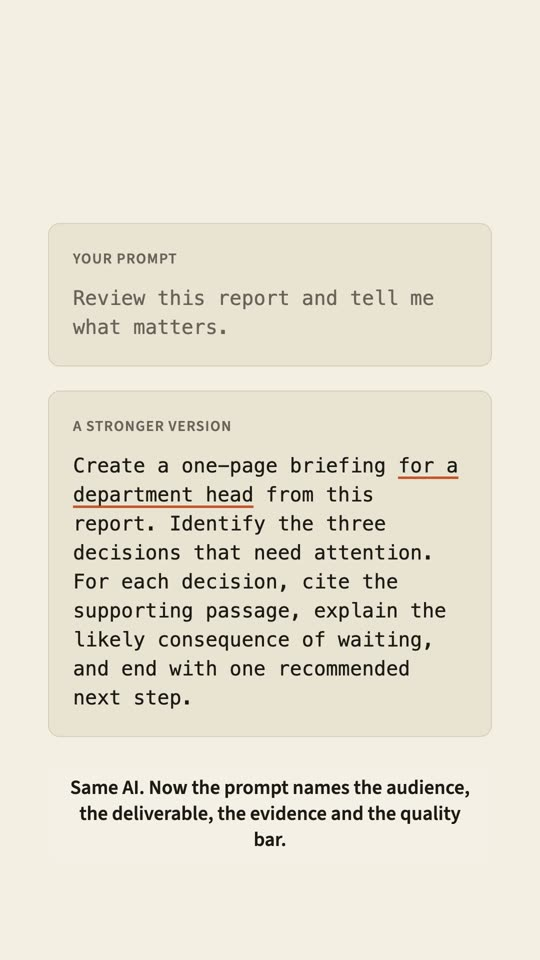

<p align="center"></p>

<p align="center"><b>An open source prompting coach for Claude Code and Codex, built around your own work.</b><br>
<a href="https://entuvo.github.io/prompting-wizard/">Website</a> · <a href="#start">Start</a> · <a href="COACHING.md">Coaching</a> · <a href="https://github.com/Entuvo/prompting-wizard/issues">Issues</a></p>

<p align="center"><a href="https://youtube.com/shorts/4eeRSs2Gi9s"></a></p>

## The same AI. Clearer direction.

> Review this report and tell me what matters.

The AI has to guess what "review" means, who the answer is for, and what shape it should take.

> Create a one-page briefing for a department head from this report. Identify the three decisions that need attention. For each decision, cite the supporting passage, explain the likely consequence of waiting, and end with one recommended next step.

Now it knows the audience, the deliverable, the evidence and the quality bar. This is not about memorizing magic phrases. It is about learning which part of your instruction controls which part of the result.

## Start

Paste this into Claude Code or Codex. It installs Prompting Wizard as a plugin and starts the course.

```text
Install or load Prompting Wizard from:

https://github.com/Entuvo/prompting-wizard/tree/main/prompting-wizard

First determine which AI environment you are running in and which capabilities it actually provides. Use its native skill, plugin, marketplace, repository, or filesystem installation method when available.

If persistent installation is unavailable but you can read GitHub, load Prompting Wizard for this chat by reading AGENTS.md and then SKILL.md from that repository path. Follow those instructions directly.

Do not overwrite an existing installation without asking me. Never claim the skill is installed unless the host confirms it. Do not stop after explaining installation or creating a package. Once Prompting Wizard is available, start the Day 0 assessment.

If this environment cannot preserve files between chats, accept an attached PROGRESS.md and return the complete updated PROGRESS.md after every state change.

If you can neither install the skill nor read its files from GitHub, state exactly which capability is missing. Do not fabricate a successful installation.
```

Prefer commands? See [all install options](https://entuvo.github.io/prompting-wizard/#install).

## How a lesson works

Thirty guided lessons, each built on a task from your own working life.

- **Write.** You write a prompt for one of your real tasks.
- **Run.** Your prompt runs exactly as you wrote it. It is not quietly improved first.
- **Compare.** When one targeted change would help, both versions run on the same material in separate contexts.
- **Improve.** You name the change that mattered and get a score against a clear standard.

Four stages: **Diagnose, Control, Build, Harden.** Work at your own pace; skipping a day costs nothing.

## Who it's for

Anyone who already asks AI for help and wants more control over the result. No coding knowledge is required for the course.

- A **teacher** turns source material into a lesson plan with a defined age level and objective.
- A **lawyer** extracts obligations, dates and exceptions, keeping conclusions tied to the text.
- A **manager** turns meeting notes into decisions, owners and deadlines.
- A **researcher** separates evidence from inference.

You bring the professional judgment. Prompting Wizard teaches you how to communicate it.

## Before your first lesson

Your practice prompts run for real, and may have the same file and network access as your AI session. Start in a folder you are comfortable letting an AI inspect, not a repository with important uncommitted work.

Your progress stays with you, in a plain `PROGRESS.md` file you can read or edit. Learning outcomes have not yet been established through human learner testing.

## More

- [Website](https://entuvo.github.io/prompting-wizard/): the full course outline, install options, `pw` commands and updates
- [Optional local coaching](COACHING.md) · [Privacy](PRIVACY.md) · [Terms](TERMS.md) · [Support](SUPPORT.md)
- **Contributing:** lessons live in `prompting-wizard/days/`, rubrics in `prompting-wizard/rubrics.md`. Run `python3 tools/validate.py --complete`, `python3 tools/check_site.py` and the `tools/test_*.py` suites before a pull request. Enable the repo hooks once per clone: `git config core.hooksPath tools/hooks`.

MIT License · Made by [Entuvo](https://www.entuvo.com), a venture studio that builds AI Native businesses.
